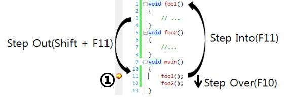

# Debugging

> 디버깅에 대해서 학습했습니다.

## breakpoints란

브레이크포인트(breakpoint)는 프로그램을 의도적으로 멈추게 하는 중단점을 뜻하는 말입니다. 프로그래머는 브레이크포인트를 사용해 실행이 중단되어 있는 상황에서 레지스터, 메모리, 로그 파일 등을 점검하여 프로그램이 예측한대로 기능하고 있는지, 문제점이 무엇인지 알아낼 수 있습니다.

## watch 사용법

브레이크포인트가 발생하면, 프로그램의 상태를 조사하거나, 이를 바꾸는 많은 툴들이 사용됩니다. watch는 그 중에 하나로, 표현식을 입력하여 유효한 JavaScript의 표현식의 값을 볼 수 있는 도구입니다.

크롬에서는 개발자도구(F12)를 활성화하고 Sources 창에서 debugger창을 활성화시키고 watch 창에서 확인하고자하는 표현식을 추가(`+` 버튼)하여 확인할 수 있습니다.

VSCode를 사용할 경우 breakpoint를 설정한 후 `Run > Start Debugging` 을 실행하고 왼쪽에 나타나는 watch 창에서 확인하고자하는 표현식을 입력해 확인할 수 있습니다.

## call stack의 의미

호출 스택은 여러 함수들(functions)을 호출하는 스크립트에서 해당 위치를 추적하는 인터프리터를 위한 메커니즘입니다. 현재 어떤 함수가 동작하고있는 지, 그 함수 내에서 어떤 함수가 동작하는 지, 다음에 어떤 함수가 호출되어야하는 지 등을 제어합니다.

스크립트가 함수를 호출하면 인터프리터는 이를 호출 스택에 추가한뒤 실행합니다. 해당 함수에 의해 호출된 모든 함수는 호출 스택에 추가되고 메인 함수가 끝나면 인터프리터는 스택을 제거하고 메인 코드 목록에서 중된던 지점부터 다시 실행됩니다. 만약 스택이 할당된 공간보다 많은 공간을 차지하면 "stack overflow" 에러가 발생합니다.

크롬 디버깅 기능을 호출 스택 창에서 현재 스택에 있는 함수 또는 프로시저 호출을 볼 수 있습니다. 호출 스택 창에는 메서드와 함수가 호출되는 순서가 표시됩니다. 호출 스택은 앱의 실행 흐름을 검사하고 파악할 수 있는 좋은 방법입니다.

## Step over / Step into / Step out

### Step over

한줄을 실행합니다. 함수가 있어도 함수 내부로 진입하지 않고 함수를 실행 후 다음 라인으로 넘어가게 됩니다.

### Step into

디버깅 실행 중 함수를 실행 할 때 함수 내부로 진입하게 되어 첫 줄에서 멈춥니다. 함수 호출이 없을 경우 Step over와 같이 동작합니다.

### Step out

현재 함수의 나머지 부분을 실행한 다음 함수 호출 뒤 다음 명령문에서 일시 중지합니다. 함수를 끝까지 실행시키고 호출시킨 곳으로 되돌아 갑니다.
